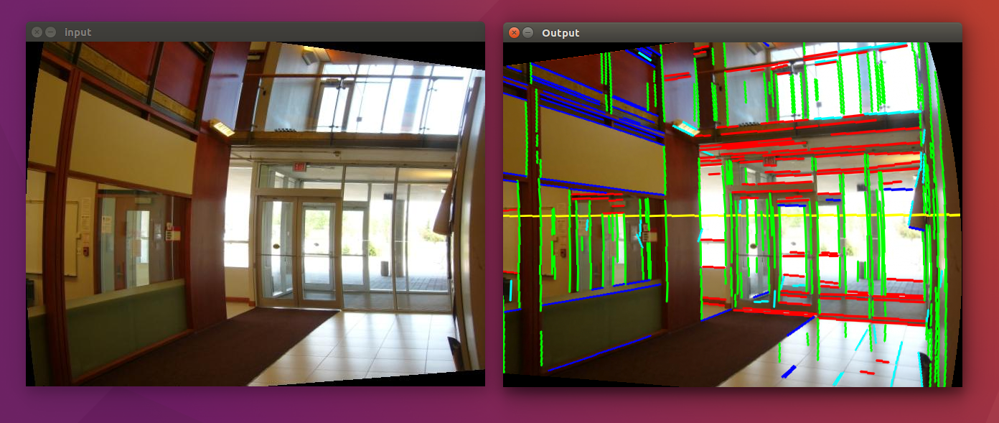

# RSVanishingPoint : Vanishing Point detection for Rolling Shutter Images

This is a C++ implementation of the following paper (Demo code)
Purkait, Pulak, Christopher Zach, and Ales Leonardis. "Rolling shutter correction in manhattan world." ICCV 2017.

https://ieeexplore.ieee.org/stamp/stamp.jsp?tp=&arnumber=8237363

For any questions or a matlab version of the code email to pulak.isi@gmail.com 

## Requirements
Opencv 

## Compile 
user@p18:~$ cmake .

user@p18:~$ make 

## Run 
user@p18:~$./vanishingPoint -image RollingShutter.jpg 

user@p18:~$./vanishingPoint -video splice.mp4

The input is a rolling shutter degraded image and the output is the motion compensated image. 

If you find the code useful, please site the following paper: 
Purkait, Pulak, Christopher Zach, and Ales Leonardis. "Rolling shutter correction in manhattan world." ICCV 2017.
